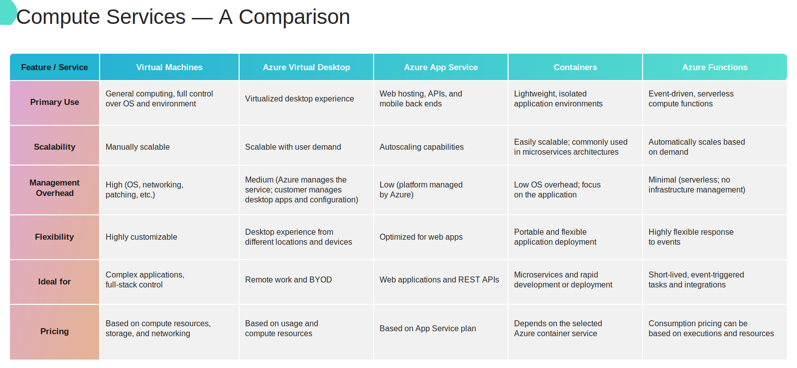
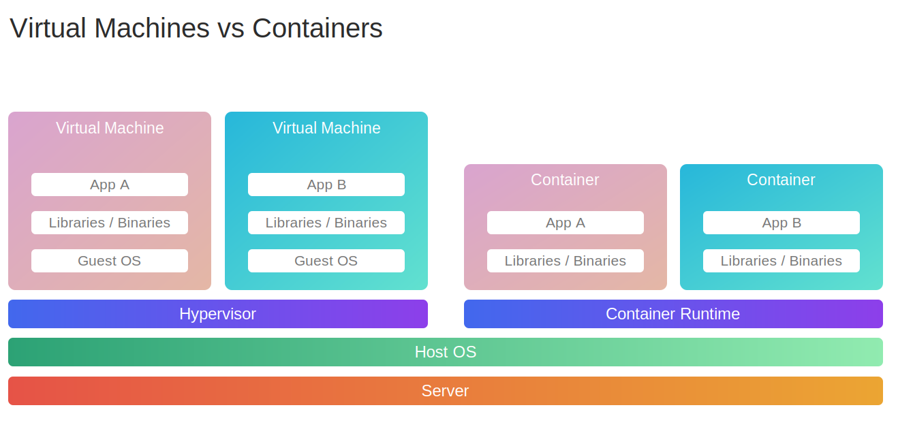
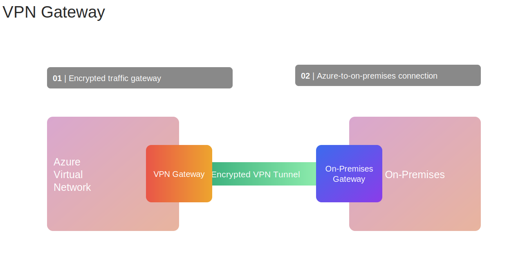

# Module 5 — Compute and Networking

## Compute choices

| Service | Model | Best fit |
|---|---|---|
| Virtual Machines | IaaS | Full OS control or legacy/custom workloads |
| Virtual Machine Scale Sets | IaaS | Many similar VMs with automatic scaling |
| Azure Virtual Desktop | Managed desktop virtualization | Secure remote Windows desktops and applications |
| Azure App Service | PaaS | Managed web applications and APIs |
| Azure Container Instances | Container service | Fast, simple container execution without orchestration |
| Azure Container Apps | Serverless containers | Event-driven apps and microservices |
| Azure Kubernetes Service | Managed Kubernetes | Complex container orchestration |
| Azure Functions | Serverless | Short, event-driven code |

## Virtual Machines

- Provide control over the guest operating system and installed software.
- The customer is responsible for OS patching, security configuration, and applications.
- Suitable for lift-and-shift migrations and workloads that need OS-level control.

### VM availability

- **Availability set:** distributes VMs across fault domains and update domains.
- **Fault domain:** separate hardware/power failure boundary.
- **Update domain:** group that may be restarted together during planned maintenance.
- **Availability zone:** physically separate data-center location in a region.

## Virtual Machine Scale Sets

- Deploy and manage a group of similar VMs.
- Scale the number of instances manually or automatically.
- Commonly distribute traffic using a load balancer.
- Good for variable, stateless workloads that still need VMs.

## Azure Virtual Desktop (AVD)

- Delivers Windows desktops and individual applications remotely.
- Supports multi-session Windows experiences.
- Integrates with Microsoft Entra ID and Microsoft 365.
- Keeps apps and data in Azure while users connect from different devices.

## Azure App Service

- Managed platform for web apps, REST APIs, and back ends.
- Supports common languages and deployment methods.
- Handles OS maintenance and platform patching.
- Supports scaling, custom domains, TLS, deployment slots, and CI/CD integration.

Choose App Service when you need a managed web platform and do not require guest-OS control.

## Containers

Containers package an application and its dependencies. They share the host OS kernel, so they normally start faster and use fewer resources than VMs.

### Virtual machines vs. containers

| Virtual machines | Containers |
|---|---|
| Include a complete guest operating system | Share the host operating system kernel |
| Provide stronger isolation and full OS control | Provide lightweight process-level isolation |
| Usually take longer to start and use more resources | Usually start faster and use fewer resources |
| Best for legacy applications or workloads needing OS-level control | Best for portable applications, microservices, and rapid scaling |

| Service | Use when |
|---|---|
| Azure Container Instances (ACI) | You need a container quickly without managing servers or an orchestrator |
| Azure Container Apps | You need serverless microservices, revisions, or event-based scaling |
| Azure Kubernetes Service (AKS) | You need Kubernetes orchestration and advanced control |

### Azure Container Instances vs. Azure Container Apps

| Azure Container Instances (ACI) | Azure Container Apps |
|---|---|
| Runs individual containers or container groups on demand | Runs containerized applications on a managed serverless platform |
| Does not provide built-in orchestration | Manages application infrastructure and orchestration for you |
| Scaling and application lifecycle are generally managed manually | Supports automatic scaling based on HTTP traffic, events, CPU, or memory |
| Does not provide application revisions or traffic splitting | Supports revisions, versioning, and traffic splitting |
| Best for simple tasks, batch jobs, testing, or short-lived workloads | Best for APIs, microservices, event-driven apps, and continuously running services |

In short: choose **ACI** when you simply need to run a container; choose **Container Apps** when you need a scalable containerized application.

### Azure Kubernetes Service (AKS)

**AKS is a managed Kubernetes service for deploying, scaling, and orchestrating containerized applications.**

#### Essential concepts

- **Cluster:** the complete Kubernetes environment.
- **Control plane:** schedules and manages workloads; Azure operates this component.
- **Node:** a virtual machine that supplies compute resources for containers.
- **Node pool:** a group of nodes with the same configuration.
- **Pod:** the smallest deployable Kubernetes unit; it contains one or more containers.

#### Important points

- Automates container deployment, scheduling, scaling, health monitoring, and recovery.
- Supports scaling both application pods and the underlying cluster nodes.
- Integrates with Azure services such as Microsoft Entra ID, Azure Monitor, and Azure networking.
- Provides more Kubernetes control and portability than ACI or Container Apps, but requires more Kubernetes knowledge and management.
- Azure manages the control plane; you remain responsible for applications, cluster configuration, security choices, and—in AKS Standard—node pools.

#### What AKS removes compared with running Kubernetes on VMs

With self-managed Kubernetes on VMs, you build and operate the entire cluster. AKS removes much of that infrastructure work:

| With Kubernetes installed on VMs, you must... | With AKS... |
|---|---|
| Install and configure the API server, scheduler, controller manager, and `etcd` | Azure provisions and operates the control plane |
| Design control-plane high availability and replace failed control-plane VMs | Azure maintains control-plane availability and health |
| Create VMs, install Kubernetes node software, and manually join nodes | AKS provisions worker nodes through managed node pools |
| Manually coordinate Kubernetes component upgrades | AKS performs the managed upgrade operation you initiate or configure automatically |
| Build node and pod scaling mechanisms yourself | AKS supports cluster autoscaling and horizontal pod autoscaling |
| Manually connect Kubernetes to Azure identity, networking, monitoring, and storage | AKS provides supported Azure integrations and add-ons |

You **still manage** your container images, Kubernetes manifests, applications, access rules, network and security configuration, scaling settings, monitoring strategy, supported Kubernetes version, and—in AKS Standard—the worker-node pools.

Choose **AKS** for complex microservices, many coordinated containers, or workloads that specifically require Kubernetes. For a simple container or a serverless containerized app, prefer **ACI** or **Azure Container Apps**.

## Azure Functions

- **Azure Functions is a Function as a Service (FaaS)** offering: you provide small pieces of code, while Azure manages the underlying servers and runtime infrastructure.
- Runs code in response to a trigger.
- Common triggers include HTTP requests, timers, queues, and data changes.
- Supports several languages natively; using a **custom handler**, you can write functions in any language that supports HTTP primitives.
- Automatically scales and commonly charges based on execution in a consumption plan.
- Best for focused event-driven work, not a traditional always-running server.

## Virtual networking

An **Azure Virtual Network (VNet)** is a private, software-defined network boundary for Azure resources. It gives you a high level of control and security over addressing, segmentation, routing, and allowed network traffic.

### How a VNet is similar to an on-premises network

A VNet is the cloud equivalent of a traditional private network, but it is created and managed in software rather than with physical networking hardware.

- You define a private IP address space, such as `10.0.0.0/16`.
- You divide the network into subnets, similar to VLANs or network segments on-premises.
- You control traffic with routing and security rules.
- Resources communicate using private IP addresses.
- DNS resolves names to IP addresses within the network.
- Gateways connect the VNet to other networks.

### Isolation, segmentation, and security

- **Isolation by default:** resources in separate VNets cannot communicate unless you explicitly connect the VNets using peering or a VPN.
- **Segmentation:** subnets divide a VNet into smaller address ranges. For example, web, application, and database resources can use separate subnets.
- **Traffic filtering:** network security groups (NSGs) allow or deny inbound and outbound traffic at the subnet or network-interface level.
- **Routing control:** route tables determine how traffic moves between subnets, virtual appliances, the internet, and connected networks.
- **Private communication:** private IP addresses allow resources to communicate without requiring direct public-internet exposure.

These controls let you design layered network security and expose only the resources and traffic that are required.

### Connecting an on-premises network to a VNet

A VNet forms the Azure side of a hybrid network. The actual connection to the on-premises network is provided by a gateway and one of these services:

- **Site-to-site VPN:** creates an encrypted IPsec/IKE tunnel over the **public internet** between an on-premises VPN device and an Azure VPN Gateway.
- **ExpressRoute:** extends the on-premises network into Azure through a private connection supplied by a connectivity provider; traffic does not traverse the **public internet**.

After routing is configured, on-premises resources and Azure resources can communicate using private IP addresses. Their IP address ranges should not overlap.

### Key VNet components

- **Subnet:** divides a VNet into smaller address ranges.
- **VNet peering:** privately connects two VNets through Microsoft’s backbone.
- **Network security group (NSG):** allows or denies inbound and outbound network traffic using rules.
- **Public IP:** enables internet-reachable addressing when required.
- **Private IP:** supports internal communication within connected private networks.

## Hybrid connectivity

| Service | Connection | Main characteristic |
|---|---|---|
| VPN Gateway | Encrypted tunnel over the **public internet** | Faster and less expensive to establish |
| ExpressRoute | Private dedicated connection through a connectivity provider | More predictable performance and does not traverse the **public internet** |

- **Site-to-site VPN:** connects an on-premises network to an Azure VNet.
- **Point-to-site VPN:** connects an individual device to an Azure VNet.

## Azure DNS

DNS works like the internet's phone book: people use an easy-to-remember name, while computers use an IP address. **Azure DNS** hosts DNS zones and records on Microsoft Azure infrastructure and translates names into IP addresses.

For example, when a user enters `app.contoso.com`, DNS can return an IP address such as `20.50.10.5`, which tells the user's device where to send the request.

### Basic DNS terms

- **Domain name:** the readable name, such as `contoso.com`.
- **DNS zone:** a container that holds the DNS records for a domain, such as the `contoso.com` zone.
- **DNS record:** an entry that maps a name to an IP address or another destination.
- **DNS query:** a request asking, “What address belongs to this name?”

### Public DNS vs. Private DNS

| Azure Public DNS | Azure Private DNS |
|---|---|
| Resolves names on the public internet | Resolves names only from linked virtual networks |
| Used for public websites, APIs, and email domains | Used for internal VMs, applications, and private endpoints |
| Records can be queried by internet users | Records are not visible or resolvable from the public internet |
| Example: `www.contoso.com` | Example: `database.internal.contoso.com` |

A private DNS zone must be linked to a VNet before resources in that VNet can resolve its records. Optional **autoregistration** can automatically create and remove DNS records for virtual machines in a linked VNet.

### Common DNS record types

- **A:** maps a name to an IPv4 address.
- **AAAA:** maps a name to an IPv6 address.
- **CNAME:** makes one name an alias of another name.
- **MX:** identifies the mail server for a domain.
- **TXT:** stores text, commonly used for domain verification and email security settings.

### Important points

- Azure DNS hosts and manages DNS records; it **does not sell or register domain names**. Buy the domain from a registrar, then delegate its DNS hosting to Azure DNS.
- Azure Public DNS is for internet-facing names; Azure Private DNS provides internal name resolution without exposing records publicly.
- Azure DNS integrates with Azure Resource Manager, so zones and records can be managed through the Azure portal, Azure CLI, PowerShell, APIs, and templates.

## Exam traps

- Containers are not miniature VMs; they share a host kernel.
- Functions are event-driven code, while App Service hosts complete web applications and APIs.
- VPN Gateway uses the public internet; ExpressRoute provides private connectivity.
- VNet peering connects VNets; it is not a VPN to a user device.
- Azure DNS hosts domains but is not a domain registrar.

## Quick check

1. Need complete control of Windows or Linux? **Azure Virtual Machines.**
2. Need a managed web app without OS patching? **Azure App Service.**
3. Need short code that runs when a queue receives a message? **Azure Functions.**
4. Need private, dedicated on-premises connectivity? **ExpressRoute.**

## References

- [KodeKloud — Compute and Networking](https://notes.kodekloud.com/docs/Microsoft-Azure-Fundamentals-AZ-900/Compute-and-Networking/Introduction)
- [KodeKloud — Compare Compute Services](https://notes.kodekloud.com/docs/Microsoft-Azure-Fundamentals-AZ-900/Compute-and-Networking/Compare-Compute-Services)
- [KodeKloud — Virtual Networking](https://notes.kodekloud.com/docs/Microsoft-Azure-Fundamentals-AZ-900/Compute-and-Networking/Virtual-Networking)
- [Microsoft Learn — Azure Container Instances overview](https://learn.microsoft.com/azure/container-instances/container-instances-overview)
- [Microsoft Learn — Azure Container Apps overview](https://learn.microsoft.com/azure/container-apps/overview)
- [Microsoft Learn — What is Azure Kubernetes Service?](https://learn.microsoft.com/azure/aks/what-is-aks)
- [Microsoft Learn — AKS core concepts](https://learn.microsoft.com/azure/aks/core-aks-concepts)
- [Microsoft Learn — AKS support policies and shared responsibilities](https://learn.microsoft.com/azure/aks/support-policies)
- [Microsoft Learn — Get started with Azure Functions](https://learn.microsoft.com/azure/azure-functions/functions-get-started)
- [Microsoft Learn — Azure Functions custom handlers](https://learn.microsoft.com/azure/azure-functions/functions-custom-handlers)
- [Microsoft Learn — Azure Virtual Network concepts and best practices](https://learn.microsoft.com/azure/virtual-network/concepts-and-best-practices)
- [Microsoft Learn — Azure virtual networks and subnets](https://learn.microsoft.com/azure/networking/design-guide/vnets-subnets)
- [Microsoft Learn — About Azure VPN Gateway](https://learn.microsoft.com/azure/vpn-gateway/vpn-gateway-about-vpngateways)
- [Microsoft Learn — What is Azure ExpressRoute?](https://learn.microsoft.com/azure/expressroute/expressroute-introduction)
- [Microsoft Learn — Azure DNS overview](https://learn.microsoft.com/azure/dns/dns-overview)
- [Microsoft Learn — Azure Private DNS overview](https://learn.microsoft.com/azure/dns/private-dns-overview)
- [Microsoft Learn — Azure Private DNS autoregistration](https://learn.microsoft.com/azure/dns/private-dns-autoregistration)
