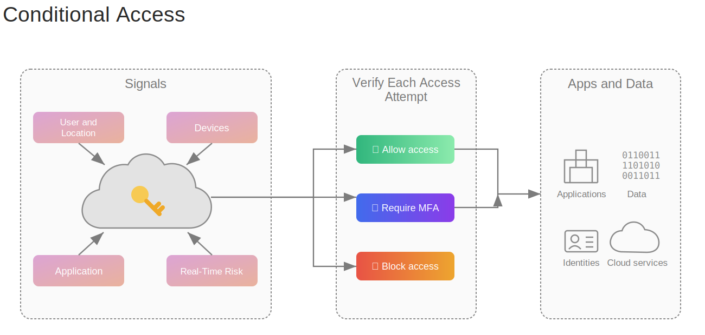
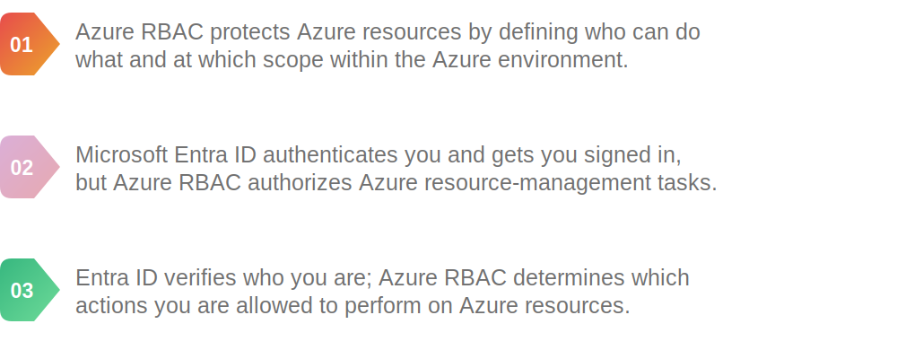

# Module 7 — Identity, Access, and Security

## Microsoft Entra ID

Microsoft Entra ID, formerly Azure Active Directory, is Azure’s cloud identity and access-management service.

It supports:

- Users, groups, applications, and devices
- Single sign-on (SSO)
- Multifactor authentication (MFA)
- Conditional Access
- Business partner and external identities
- Integration with Azure RBAC

Entra ID is not the same as traditional Windows Server Active Directory Domain Services, although the two can integrate.

## Microsoft Entra Domain Services

Microsoft Entra ID is designed for modern cloud authentication, but some older applications still expect a traditional Windows domain. They may require domain join, Group Policy, LDAP, Kerberos, or NTLM.

In simple terms, a domain is a secure network boundary where a central computer system manages access for all users, passwords, and devices.

Think of it like a private corporate digital office  building:  

The Guard Desk (Domain Controller): A central system holds the master list of everyone allowed inside.

The ID Badge (Your Login): You log in once, and the guard verifies who you are.

The Master Key (Single Sign-On): Once verified, you can access your computer, company files, and shared printers without typing your password again.

The Rulebook (Group Policy): The building managers can instantly push out rules to every computer at once, like blocking USB drives or forcing password changes.

***Why this matters for "Entra Domain Services"***

When companies move their old software to the cloud, those apps still look for that traditional "guard desk" and "rulebook" to work. Entra Domain Services mimics that traditional corporate building environment inside Microsoft's cloud, so old software feels right at home without you having to build the actual physical infrastructure.

### What it provides

- **Domain join:** joins Azure Windows or supported Linux VMs to a managed domain.
- **Group Policy:** centrally applies supported settings to domain-joined machines and users.
- **LDAP/LDAPS:** lets applications search the directory and authenticate users using a traditional directory protocol.
- **Kerberos and NTLM:** supports authentication methods required by many older Windows applications.
- **Managed DNS:** provides the DNS services required by the managed domain.

### How it works

1. You enable Entra Domain Services for a Microsoft Entra tenant and associate it with an Azure VNet.
2. Microsoft deploys and operates the managed domain controllers in Azure.
3. Users, groups, and required credentials are synchronized from Microsoft Entra ID to the managed domain.
4. VMs and applications in the connected network can join and use that domain.

The synchronization from Entra ID to the managed domain is primarily **one way**. Continue creating and managing normal users and groups in Microsoft Entra ID.

### What Microsoft manages

- Deployment and availability of the domain controllers
- Operating-system and domain-controller patching
- Monitoring, backups, and recovery of the managed domain
- Replication between the managed domain controllers

You do not sign in to, patch, or directly administer the domain-controller VMs.

### What you still manage

- Users and groups in Microsoft Entra ID
- The VNet, subnets, and network access
- Joining VMs to the domain
- Supported Group Policy settings and organizational units
- Application configuration and secure LDAP when required

### When to use it

Use Entra Domain Services when moving a legacy application to Azure that requires traditional AD DS features but you do not need full control of the domain controllers.

For a new cloud-native application, use **Microsoft Entra ID** and modern authentication. If you need complete control of the Active Directory forest, schema, trusts, or domain controllers, deploy and manage **Windows Server AD DS on Azure VMs** instead.

| Service | Best description |
|---|---|
| Microsoft Entra ID | Modern cloud identity, MFA, SSO, Conditional Access, and application access |
| Microsoft Entra Domain Services | Managed traditional domain features for legacy workloads |
| AD DS on Azure VMs | Self-managed domain controllers with maximum control and management responsibility |

## Authentication and authorization

In Azure, **Microsoft Entra ID is the primary service used to authenticate users, groups, applications, and managed identities**. It verifies who or what is signing in before Azure checks what that identity is allowed to do.

> **Simple rule:** Microsoft Entra ID handles authentication; Azure RBAC handles authorization; policies and resource-specific rules add further restrictions and governance.

Azure controls authorization through several layers:

- **Azure RBAC:** grants an identity permission to perform particular actions at a particular scope. For example, the Reader role allows a user to view a resource group.
- **Azure Policy:** applies governance rules to resources, such as requiring an allowed region or denying public IP addresses. It enforces what configurations are permitted but does not normally grant a user access.
- **Resource-specific rules:** individual services can have additional controls, such as storage access control lists, Key Vault access settings, or network security rules.

| Concept | Question answered | Example |
|---|---|---|
| Authentication | Who are you? | Sign in with a password and phone prompt |
| Authorization | What are you allowed to do? | Reader access to a resource group |

Authentication happens before authorization.

## Multifactor authentication

MFA requires factors from at least two different categories:

- **Something you know:** password or PIN
- **Something you have:** phone, token, or security key
- **Something you are:** fingerprint or face

Two passwords are not MFA because both are the same factor type.

## Conditional Access

**Conditional Access is Microsoft Entra ID's policy engine for checking the circumstances of a sign-in before allowing access to an application or data.** It provides extra protection when a sign-in appears risky instead of treating every access attempt in exactly the same way.

In simple terms, it follows an **if-then** rule:

> **If** a particular user, device, location, application, or risk condition is detected, **then** allow access, require an extra security control, or block access.

### How Conditional Access works

1. A user first attempts to sign in through Microsoft Entra ID.
2. Conditional Access collects signals about that access attempt.
3. Entra ID evaluates all applicable Conditional Access policies.
4. Access is allowed, blocked, or allowed only after the required controls are satisfied.

Conditional Access does not replace the initial sign-in. It uses the sign-in context to decide whether more verification or restrictions are required.

### Signals it can evaluate

- **User or group:** who is requesting access.
- **Application:** which cloud application or resource is being requested.
- **Device:** whether the device is known, managed, compliant, or using a particular platform.
- **Location or network:** where the request comes from, such as a trusted office network or another country.
- **Sign-in or user risk:** whether Microsoft Entra ID Protection detects suspicious behavior or a potentially compromised identity.

### Detecting suspicious usage patterns

Microsoft Entra ID Protection can learn a user's normal sign-in patterns and examine properties such as the IP address, location, device, browser, and network. If a new sign-in looks different from the user's normal behavior, it can be marked as risky.

For example, suppose a user normally signs in from India using the same work laptop. A sudden sign-in from an unfamiliar country, IP address, browser, or device could trigger an **unfamiliar sign-in properties** risk detection.

- **Sign-in risk:** the likelihood that this particular authentication request was not made by the real account owner.
- **User risk:** the likelihood that the user's identity or credentials have been compromised.
- Risk can be categorized as **low, medium, or high**, depending on Microsoft's confidence in the detection.

Conditional Access can use the detected risk level to respond automatically:

- Allow a low-risk sign-in normally.
- Require MFA to verify a medium-risk sign-in.
- Require a secure password change when the user identity is considered at risk.
- Block a high-risk sign-in.

An unusual sign-in is a warning signal, not automatic proof of an attack. The organization's Conditional Access policies determine what happens at each risk level. Risk-based Conditional Access and the detailed Identity Protection detections require the appropriate Microsoft Entra ID P2 licensing.

### Controls it can enforce

- Allow access without an additional challenge.
- Require multifactor authentication (MFA) or a particular authentication strength.
- Require a compliant or Microsoft Entra joined device.
- Require an approved application or application-protection policy.
- Require acceptance of terms of use.
- Block access completely.

### Simple examples

- **If** an employee signs in from a new country, **then** require MFA.
- **If** a user tries to access sensitive company data from a noncompliant device, **then** block access.
- **If** an administrator opens an administration portal, **then** require stronger authentication.
- **If** a user signs in from a trusted location using a compliant device, **then** allow access normally.

> **Exam tip:** Conditional Access controls the conditions for accessing apps and data. Azure RBAC separately controls what actions the authenticated user can perform on Azure resources.

## External identities

| Scenario | Course term | Purpose |
|---|---|---|
| Partner or supplier collaborates with your organization | B2B | Guest uses an external identity to access organizational resources |
| Customer signs into a consumer-facing app | B2C | Customer identity and social/local sign-in experiences |

Microsoft’s external-identity product names evolve, but the exam distinction remains: workforce collaboration versus customer identity.

## Azure role-based access control (RBAC)

Azure RBAC controls who can perform management actions at a scope.

A role assignment combines:

`Security principal + Role definition + Scope`

### Common built-in roles

| Role | Permission summary |
|---|---|
| Owner | Full resource management and can assign access |
| Contributor | Full resource management but cannot assign RBAC roles |
| Reader | View resources but cannot change them |
| User Access Administrator | Manage user access to Azure resources |

### Scopes

`Management group → Subscription → Resource group → Resource`

Assignments inherit downward. Follow **least privilege**: grant only the access needed, at the narrowest practical scope.

## Zero Trust

Three core principles:

1. **Verify explicitly:** authenticate and authorize every access request using available information such as identity, location, device health, application, and risk. Do not trust someone only because they are inside the company network.
   - *Example:* Conditional Access requires MFA when a user signs in from an unfamiliar location or device.
2. **Use least-privilege access:** provide only the permissions needed for the required task, at the narrowest scope and for the shortest practical time.
   - *Example:* assign Contributor access to one resource group instead of Owner access to the entire subscription.
3. **Assume breach:** design security as though an attacker might already be inside the environment. Segment resources, encrypt data, monitor activity, and prepare to contain an incident.
   - *Example:* place application and database resources in separate subnets and restrict traffic so a compromised application cannot freely reach everything else.

> **Simple summary:** verify every request, grant the minimum access, and limit the damage if something is compromised.

## Defense in depth

Multiple security layers reduce the chance that one failed control compromises the whole system:

1. Physical security
2. Identity and access
3. Perimeter
4. Network
5. Compute
6. Application
7. Data

Data is the final asset being protected, while identity increasingly acts as the modern security perimeter.

## Microsoft Defender for Cloud

- Assesses security posture across Azure and connected environments.
- Produces a secure score and prioritized recommendations.
- Helps monitor compliance.
- Provides workload threat-protection capabilities.
- Can cover Azure, on-premises, and supported multicloud resources.

## Exam traps

- Authentication proves identity; authorization grants permissions.
- RBAC controls actions, while Conditional Access controls sign-in conditions.
- Contributor cannot grant RBAC access; Owner can.
- Entra Domain Services supplies managed legacy domain protocols; Entra ID is cloud IAM.
- Zero Trust means “verify explicitly,” not “block every request.”

## Quick check

1. Which service manages Azure cloud identities? **Microsoft Entra ID.**
2. Which control can require MFA only for a risky sign-in? **Conditional Access.**
3. Which role can manage resources but not assign access? **Contributor.**
4. What are the three Zero Trust principles? **Verify explicitly, least privilege, and assume breach.**

## References

- [KodeKloud — Identity, Access, and Security](https://notes.kodekloud.com/docs/Microsoft-Azure-Fundamentals-AZ-900/Identity-Access-and-Security/Introduction)
- [KodeKloud — RBAC](https://notes.kodekloud.com/docs/Microsoft-Azure-Fundamentals-AZ-900/Identity-Access-and-Security/RBAC)
- [KodeKloud — Zero Trust](https://notes.kodekloud.com/docs/Microsoft-Azure-Fundamentals-AZ-900/Identity-Access-and-Security/Zero-Trust)
- [Microsoft Learn — Microsoft Entra Domain Services overview](https://learn.microsoft.com/entra/identity/domain-services/overview)
- [Microsoft Learn — Common Entra Domain Services scenarios](https://learn.microsoft.com/entra/identity/domain-services/scenarios)
- [Microsoft Learn — Azure RBAC overview](https://learn.microsoft.com/azure/role-based-access-control/overview)
- [Microsoft Learn — Azure Policy overview](https://learn.microsoft.com/azure/governance/policy/overview)
- [Microsoft Learn — Microsoft Entra Conditional Access](https://learn.microsoft.com/entra/identity/conditional-access/overview)
- [Microsoft Learn — Build Conditional Access policies](https://learn.microsoft.com/entra/identity/conditional-access/concept-conditional-access-policies)
- [Microsoft Learn — Microsoft Entra ID Protection risk detections](https://learn.microsoft.com/entra/id-protection/concept-identity-protection-risks)
- [Microsoft Learn — Sign-in risk-based MFA](https://learn.microsoft.com/entra/identity/conditional-access/policy-risk-based-sign-in)
- [Microsoft Learn — Zero Trust security in Azure](https://learn.microsoft.com/azure/security/fundamentals/zero-trust)
