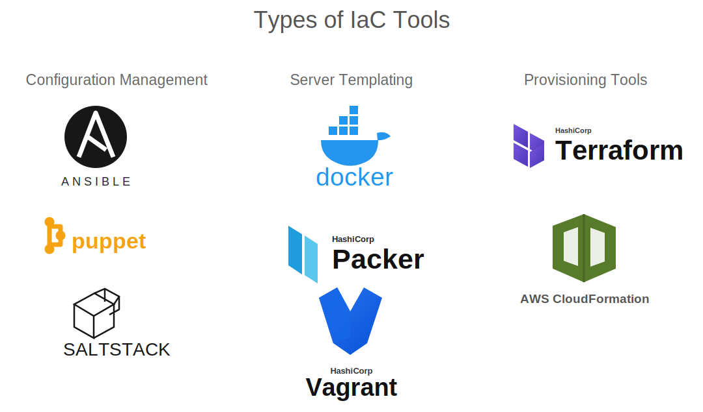

# Module 2 — Introduction to Infrastructure as Code

## Problems with traditional infrastructure

Manually creating infrastructure creates several problems:

- Slow, repetitive provisioning
- Different configurations between environments
- Human error and configuration drift
- Poor change history
- Difficult disaster recovery
- Knowledge trapped with individual administrators
- Hard-to-repeat scaling and deployments

## Infrastructure as Code (IaC)

IaC means defining and managing infrastructure through machine-readable files. These files can be reviewed, versioned, tested, and automated like application code.

Benefits include:

- Repeatability and consistency
- Faster provisioning
- Version control and peer review
- Automation through CI/CD
- Easier recovery and environment recreation
- Reduced manual drift

## Types of IaC tools

| Category | Main job | Examples |
|---|---|---|
| Provisioning | Create infrastructure resources | Terraform, OpenTofu, CloudFormation |
| Configuration management | Configure operating systems and software | Ansible, Puppet, Chef |
| Server templating | Build reusable machine/container images | Packer, Docker |
| Orchestration | Deploy and coordinate applications/services | Kubernetes |

The categories can overlap. A common workflow is Terraform for infrastructure, Packer for images, and Ansible or cloud-init for machine configuration.

### Why server templating is Infrastructure as Code

Server templating tools define a reusable machine or container image in a code file instead of manually configuring each server.

- A Packer template can describe the base operating system, software, files, and commands required to build a virtual-machine image.
- A Dockerfile describes the steps and dependencies used to build a container image.
- The resulting image can be versioned, reviewed, tested, and rebuilt consistently.
- New servers or containers are created from the same known image instead of being changed manually after deployment. This approach is often called **immutable infrastructure**.

Server templating is therefore IaC because the required server or container environment is defined as repeatable code.

### Why orchestration is Infrastructure as Code

Orchestration tools define how multiple application and infrastructure components should run together.

- A Kubernetes manifest can declare deployments, pods, services, networking, storage, replica counts, and update behavior in YAML files.
- The orchestrator reads the desired state and continuously works to keep the running environment in that state.
- The files can be stored in version control, reviewed, reused across environments, and applied automatically through CI/CD.

Orchestration is considered part of the broader IaC approach because the desired runtime environment and relationships between components are managed through code rather than manual actions. It normally operates **after the underlying infrastructure has been provisioned**.

### Provisioning vs. configuration management

| Provisioning | Configuration management |
|---|---|
| Creates the infrastructure on which workloads run | Configures the operating system and software on existing infrastructure |
| Manages resources such as VNets, subnets, VMs, databases, and load balancers | Manages packages, users, files, services, security settings, and application configuration |
| Usually happens first | Usually happens after a server has been provisioned |
| Answers: “What infrastructure must exist?” | Answers: “How must this server be configured?” |
| Common tools: Terraform, OpenTofu, CloudFormation, ARM, and Bicep | Common tools: Ansible, Puppet, Chef, and Salt |

**Simple example:** Terraform provisions three virtual machines and a load balancer. Ansible then installs a web server, copies configuration files, and starts the service on those VMs.

The boundary can overlap because some configuration-management tools can create cloud resources and some provisioning tools can run setup commands. However, keeping provisioning and machine configuration as separate responsibilities usually makes the automation easier to understand and maintain.

## Declarative and imperative approaches

| Declarative | Imperative |
|---|---|
| Describe the desired final state | Describe each step to perform |
| Tool determines the required actions | Author controls the action sequence |
| Easier to compare desired and actual state | Often straightforward for small procedural tasks |

Terraform is primarily declarative.

## Why Terraform?

- Provider ecosystem supports many platforms.
- A consistent HCL workflow works across providers.
- Plans show proposed changes before execution.
- State maps configuration to managed objects.
- Dependency graphs determine operation order and parallelism.
- Modules make configurations reusable.
- It is useful for multicloud and hybrid environments.

## Terraform architecture

| Component | Role |
|---|---|
| Terraform CLI/Core | Reads configuration, builds a graph, creates plans, and manages state |
| Provider | Plugin that communicates with a platform API |
| Resource | Infrastructure object Terraform creates or manages |
| Data source | Existing/read-only information Terraform queries |
| State | Terraform’s record connecting resource addresses to real objects |

## Desired-state thinking

Instead of saying:

> Create a network, then create three servers, then attach disks.

You describe the network, servers, and disks that must exist. Terraform calculates a safe operation order from references and dependencies.

## Limitations

- Terraform does not automatically fix poor architecture.
- State must be protected and coordinated.
- Provider/API behavior still matters.
- Out-of-band changes can cause drift.
- Terraform is not usually the best tool for continuous application deployment or detailed OS configuration.

## Quick check

1. What problem does IaC solve? **Repeatable, reviewable, automated infrastructure management.**
2. Is Ansible mainly a provisioning or configuration-management tool? **Configuration management.**
3. Why does Terraform keep state? **To map configuration addresses to real infrastructure objects.**

## References

- [KodeKloud course](https://learn.kodekloud.com/user/courses/terraform-basics-training-course)
- [Terraform introduction to IaC](https://developer.hashicorp.com/terraform/tutorials/aws-get-started/infrastructure-as-code)
