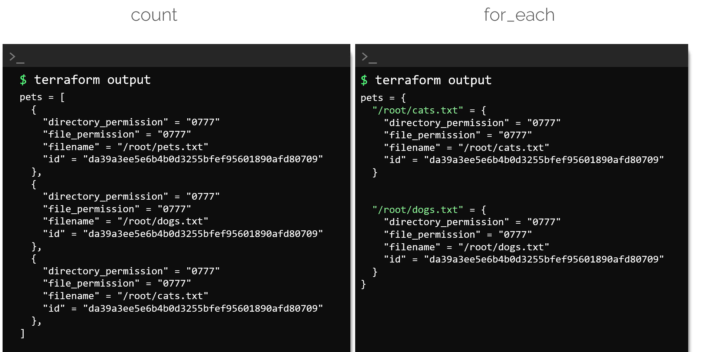

# Module 6 — Working with Terraform

## Essential commands

| Command | Purpose |
|---|---|
| `terraform init` | Initialize providers, modules, and backend |
| `terraform fmt -recursive` | Format configuration files |
| `terraform validate` | Validate configuration syntax and consistency |
| `terraform plan` | Preview changes |
| `terraform apply` | Apply changes |
| `terraform destroy` | Destroy managed objects |
| `terraform show` | Display state or a saved plan |
| `terraform output` | Display root-module outputs |
| `terraform providers` | Show provider requirements |
| `terraform console` | Evaluate Terraform expressions interactively |

Automation should normally use noninteractive flags carefully and apply a previously generated plan rather than blindly applying unreviewed changes.

## Mutable and immutable infrastructure

| Mutable | Immutable |
|---|---|
| Existing servers are changed in place | Old instances are replaced with new ones |
| Can accumulate configuration drift | Produces more consistent, reproducible instances |
| Often uses configuration-management tools | Often uses images, containers, and replacement deployments |

Terraform can perform both in-place updates and replacements depending on resource/provider behavior.

## Lifecycle rules

```hcl
resource "aws_instance" "web" {
  ami           = var.ami_id
  instance_type = var.instance_type

  lifecycle {
    create_before_destroy = true
    prevent_destroy       = true
  }
}
```

| Rule | Purpose |
|---|---|
| `create_before_destroy` | Create the replacement before deleting the old object |
| `prevent_destroy` | Reject plans that would destroy the object while the rule is present |
| `ignore_changes` | Ignore selected externally managed attribute changes during updates |
| `replace_triggered_by` | Replace when referenced resources or attributes change |

Use `ignore_changes` narrowly; excessive use can hide important drift. `prevent_destroy` is a safety rule, not a backup.

## Data sources

A data source reads existing information without creating that object:

```hcl
data "aws_ami" "ubuntu" {
  most_recent = true
  owners      = ["099720109477"]

  filter {
    name   = "name"
    values = ["ubuntu/images/hvm-ssd/ubuntu-*-amd64-server-*"]
  }
}
```

Reference it with:

```hcl
data.aws_ami.ubuntu.id
```

| Resource | Data source |
|---|---|
| Creates or manages an object | Reads an existing object/value |
| `resource "TYPE" "NAME"` | `data "TYPE" "NAME"` |

## Meta-arguments

Meta-arguments change how Terraform manages a block. Common examples include `depends_on`, `count`, `for_each`, `provider`, and `lifecycle`.

### `count`

```hcl
resource "local_file" "example" {
  count    = 3
  filename = "file-${count.index}.txt"
  content  = "example"
}
```

Addresses use numeric indexes:

```text
local_file.example[0]
```

### `for_each`

```hcl
resource "local_file" "example" {
  for_each = toset(["dev", "test", "prod"])
  filename = "${each.key}.txt"
  content  = each.value
}
```

Addresses use stable keys:

```text
local_file.example["prod"]
```

### Choosing between them

- Use `count` for nearly identical numbered instances.
- Use `for_each` when instances have meaningful stable keys or different values.
- Removing an item from the middle of a `count` list can shift indexes and cause unexpected changes.
- A block cannot use both `count` and `for_each`.

### Why `for_each` is safer when items are removed

Suppose a variable contains these filenames:

```hcl
filenames = ["a.txt", "b.txt", "c.txt"]
```

With `count`, Terraform identifies the files by numeric position: `[0]`, `[1]`, and `[2]`. If `b.txt` is removed, `c.txt` shifts from index `[2]` to `[1]`. Terraform can therefore destroy or replace the removed file and resources after it because their indexes no longer match the same filenames.

With `for_each = toset(var.filenames)`, each filename is its own stable key:

```text
local_file.example["a.txt"]
local_file.example["b.txt"]
local_file.example["c.txt"]
```

Removing `b.txt` removes only `local_file.example["b.txt"]`; the identities of `a.txt` and `c.txt` do not change. Use `for_each` when list items may be added or removed independently.

The output also reflects the identity difference: `count` instances are commonly represented as an ordered list, while `for_each` instances are represented as a map using their stable keys.



## Version constraints

Terraform CLI constraint:

```hcl
terraform {
  required_version = ">= 1.8, < 2.0"
}
```

Provider constraint:

```hcl
terraform {
  required_providers {
    aws = {
      source  = "hashicorp/aws"
      version = "~> 6.0"
    }
  }
}
```

| Operator | Meaning |
|---|---|
| `= 1.2.3` | Exactly this version |
| `>= 1.2.0` | This version or newer |
| `!= 1.2.3` | Exclude one version |
| `~> 1.2` | Allow compatible versions below `2.0.0` |
| `~> 1.2.3` | Allow patch releases below `1.3.0` |

Root modules should set sensible upper and lower bounds. Reusable modules should avoid unnecessarily restrictive provider constraints.

## Quick check

1. What reads existing infrastructure information? **A data source.**
2. Which lifecycle rule reduces replacement downtime? **`create_before_destroy`.**
3. Which gives stable named instances: `count` or `for_each`? **`for_each`.**
4. Where are selected provider versions recorded? **`.terraform.lock.hcl`.**

## References

- [Terraform CLI commands](https://developer.hashicorp.com/terraform/cli/commands)
- [Lifecycle meta-argument](https://developer.hashicorp.com/terraform/language/meta-arguments/lifecycle)
- [`count`](https://developer.hashicorp.com/terraform/language/meta-arguments/count)
- [`for_each`](https://developer.hashicorp.com/terraform/language/meta-arguments/for_each)
- [Version constraints](https://developer.hashicorp.com/terraform/language/expressions/version-constraints)
