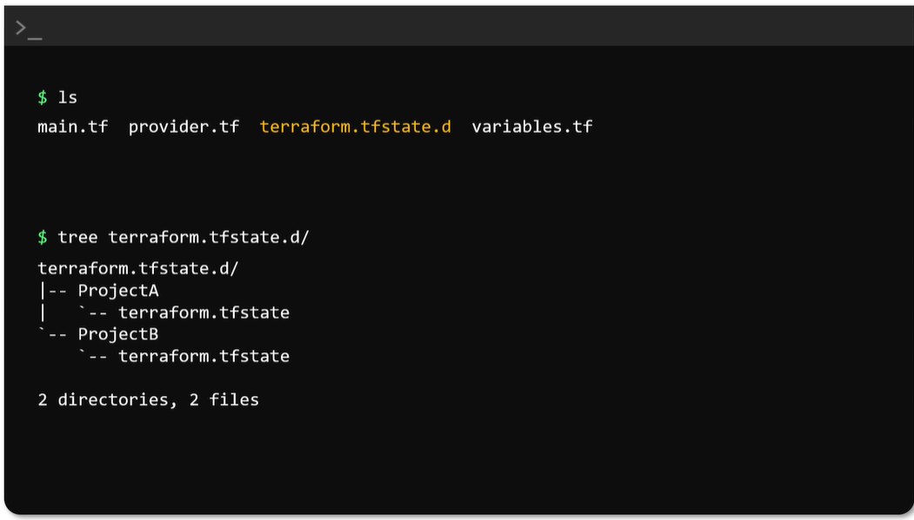

# Terraform Modules vs Workspaces

## Quick Comparison

| Terraform Modules | Terraform Workspaces |
|---|---|
| Used to organize and reuse Terraform code | Used to maintain separate Terraform state |
| Defines what infrastructure should be created | Defines which copy of the infrastructure is managed |
| Avoids repeating resource code | Avoids mixing resources from separate environments |
| Example: reusable EC2, VPC, or database module | Example: `dev`, `test`, and `prod` workspaces |
| Module code can be called multiple times | The same Terraform configuration is used with different state files |

---

# 1. Terraform Modules

A Terraform module is a collection of Terraform files that work together.

It is used to create **reusable infrastructure code**.

## Simple Meaning

> A module is a reusable infrastructure blueprint.

For example, instead of writing the EC2 resource configuration repeatedly, you can create one EC2 module and call it whenever needed.

## Example Folder Structure

```text
terraform-module-example/
├── main.tf
├── variables.tf
├── outputs.tf
└── modules/
    └── ec2/
        ├── main.tf
        ├── variables.tf
        └── outputs.tf
```

## Child Module

File: `modules/ec2/main.tf`

```hcl
resource "aws_instance" "server" {
  ami           = var.ami_id
  instance_type = var.instance_type

  tags = {
    Name = var.instance_name
  }
}
```

File: `modules/ec2/variables.tf`

```hcl
variable "ami_id" {
  type = string
}

variable "instance_type" {
  type = string
}

variable "instance_name" {
  type = string
}
```

File: `modules/ec2/outputs.tf`

```hcl
output "instance_id" {
  value = aws_instance.server.id
}
```

## Root Module Calling the Child Module

File: `main.tf`

```hcl
provider "aws" {
  region = "us-east-1"
}

module "web_server" {
  source = "./modules/ec2"

  ami_id        = "ami-0123456789abcdef0"
  instance_type = "t2.micro"
  instance_name = "WebServer"
}
```

## What Happens?

Terraform calls the EC2 module and creates an EC2 instance using the values passed from the root module.

```text
Root module
     │
     └── Calls EC2 module
              │
              └── Creates EC2 instance
```

---

# 2. Terraform Workspaces

A Terraform workspace provides a separate Terraform state for the same Terraform configuration.

This allows the same code to manage different copies of infrastructure.

## Simple Meaning

> A workspace is a separate save slot for the same Terraform code.

## Example Folder Structure

```text
terraform-workspace-example/
├── main.tf
├── variables.tf
├── outputs.tf
└── terraform.tfvars
```

The folder contains only one Terraform configuration. Terraform creates and manages the workspace state separately.

After creating workspaces, Terraform may store local workspace states like this:

```text
terraform-workspace-example/
├── main.tf
├── variables.tf
├── outputs.tf
├── terraform.tfstate
└── terraform.tfstate.d/
    ├── dev/
    │   └── terraform.tfstate
    └── test/
        └── terraform.tfstate
```

> The `default` workspace commonly uses `terraform.tfstate`. Other local workspaces use separate state directories.

## State File per Workspace

**When using the local backend, running `terraform apply` in a selected non-default workspace creates or updates a separate state file at `terraform.tfstate.d/<workspace>/terraform.tfstate`. This keeps each workspace's infrastructure state isolated.**



## Workspace Example

File: `main.tf`

```hcl
provider "aws" {
  region = "us-east-1"
}

resource "aws_instance" "server" {
  ami           = "ami-0123456789abcdef0"
  instance_type = "t2.micro"

  tags = {
    Name        = "${terraform.workspace}-server"
    Environment = terraform.workspace
  }
}
```

## Create the Workspaces

```bash
terraform init

terraform workspace new dev
terraform workspace new test
terraform workspace new prod
```

View all workspaces:

```bash
terraform workspace list
```

Select the development workspace:

```bash
terraform workspace select dev
terraform apply
```

Terraform creates:

```text
dev workspace → dev state → dev-server
```

Select the production workspace:

```bash
terraform workspace select prod
terraform apply
```

Terraform creates:

```text
prod workspace → prod state → prod-server
```

Both resources are created from the same `main.tf`, but their states are kept separate.

---

# Modules and Workspaces Together

Modules and workspaces solve different problems, so they can also be used together.

## Example Folder Structure

```text
terraform-project/
├── main.tf
├── variables.tf
├── outputs.tf
└── modules/
    └── ec2/
        ├── main.tf
        ├── variables.tf
        └── outputs.tf
```

File: `main.tf`

```hcl
provider "aws" {
  region = "us-east-1"
}

module "server" {
  source = "./modules/ec2"

  ami_id        = "ami-0123456789abcdef0"
  instance_type = "t2.micro"
  instance_name = "${terraform.workspace}-server"
}
```

Here:

- The **module** provides reusable EC2 code.
- The **workspace** creates separate state and resources for `dev`, `test`, or `prod`.

```text
Same reusable module
        │
        ├── dev workspace  → dev state  → dev server
        ├── test workspace → test state → test server
        └── prod workspace → prod state → prod server
```

---

# Simple Analogy

- **Module = House blueprint**
- **Workspace = Different houses built using the blueprint**

---

# Key Difference

> Modules separate and reuse Terraform code, while workspaces separate Terraform state and resource instances.
